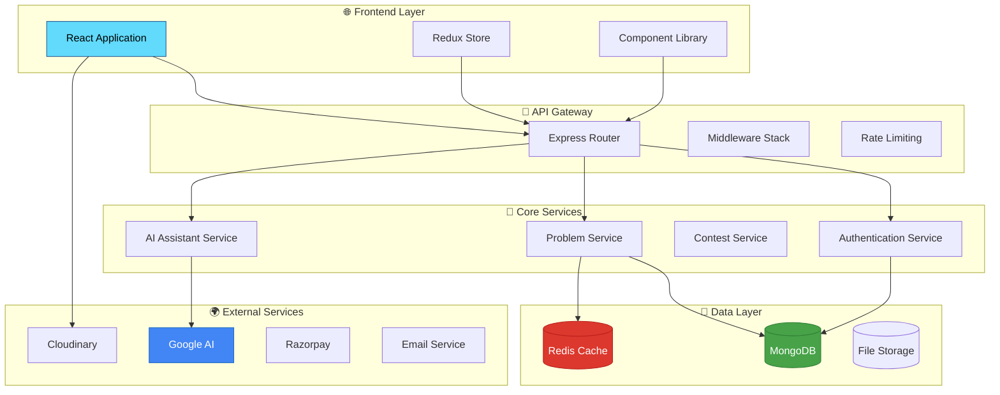

# Code Execution Platform Documentation:- ByteBattle

## Overview
This document outlines the structure and functionality of a code execution platform designed to allow users to write, run, and test code in various programming languages within a secure and user-friendly environment.
## System Architecture
### Frontend
- **Tech Stack**: HTML, CSS, JavaScript (with React frameworks) and daisyUI library.
- **Components**:
  - Code editor ( using Monaco Editor).
  - Input panel for custom user inputs.

- **Features**:
-  **User Signup/Login**: used react form and zod library for validation
- **Problem Browsing and Submission**
- **AI Chat Support**:   using Gemini Api 
- **Admin Panel** for uploading problems, videos(by using Cloudinary)
- **Submission History and Editorial View**
- **Redux State Management**
- **Axios for API Requests**

### Backend
- **Tech Stack**: Node.js, express.js.

- **Features**:
-  **User Authentication & Authorization**: Implements JWT (JSON Web Tokens) for secure user authentication.
-  **Problem Creation and Management**
-  **Code Submission & Evaluation**
-  **Solution Video Uploads**  // Used Cloudinary for storing videos  
-  **AI Chatbot for Solving Doubts**
-  **Admin & User Middlewares**
-  **Rate Limiting via Redis**

### Database
- **Database**: MongoDB for storing user data, problem sets, and submission history, and Redis for rate limiting and logout feature.
- **Code Execution Engine**: Utilizes Judge-0 API to  execute user code securely.


## File Structure

The project is organized into the following directories and files:

```bash
ByteBattle-Frontend/
├── public/ # Static files (index.html, favicon, etc.)
├── src/
│ ├── assets/ # Images, icons, and other media
│ ├── components/ # Reusable UI components
│ │ ├── AdminDelete.jsx
│ │ ├── AdminPanel.jsx
│ │ ├── AdminUpload.jsx
│ │ ├── AdminVideo.jsx
│ │ ├── ChatAi.jsx
│ │ ├── Editorial.jsx
│ │ └── SubmissionHistory.jsx
│ ├── pages/ # Top-level page components
│ │ ├── Admin.jsx
│ │ ├── Homepage.jsx
│ │ ├── Login.jsx
│ │ ├── ProblemPage.jsx
│ │ └── Signup.jsx
│ ├── store/ # Redux store
│ │ └── store.js
│ ├── utils/ # Utility functions and API clients
│ │ └── axiosClient.js
│ ├── App.css # Global styles
│ ├── App.jsx # Root component
│ ├── authSlice.js # Redux auth slice
│ ├── index.css # App-level styles
│ └── main.jsx # Entry point
│ └── index.html 

ByteBattle-Backend/
├── src/
│ ├── config/ # Configuration files
│ │ ├── db.js # MongoDB setup
│ │ └── redis.js # Redis setup (for caching or rate limiting)
│ ├── controllers/ # Request/response logic
│ │ ├── solveDoubt.js
│ │ ├── userAuthent.js
│ │ ├── userProblem.js
│ │ ├── userSubmission.js
│ │ └── videoSection.js
│ ├── middleware/ # Custom Express middlewares
│ │ ├── adminMiddleware.js
│ │ ├── submitCodeRateLimiter.js
│ │ └── userMiddleware.js
│ ├── models/ # Mongoose models
│ │ ├── problem.js
│ │ ├── solutionVideo.js
│ │ ├── submission.js
│ │ └── user.js
│ ├── routes/ # Route definitions
│ │ ├── aiChatting.js
│ │ ├── problemCreator.js
│ │ ├── submit.js
│ │ ├── userAuth.js
│ │ └── videoCreator.js
│ └── utils/
│ └── index.js
├── .env # Environment variables
├── .gitignore
├── package-lock.json
├── package.json
└── README.md
```


## 🛠️ **Technology Stack**

<div align="center">

### **Backend Architecture**


### **Frontend Experience**


### **Cloud & Services**


</div>
---
## 🏗️ **System Architecture**

<div align="center">


